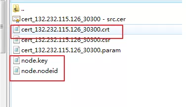
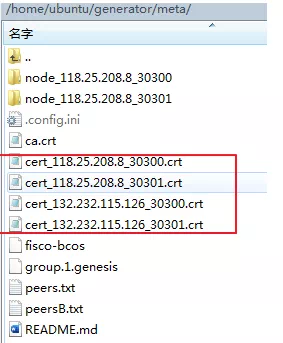

# FISCO BCOS上使用第三方CA证书底层节点部署实操

作者：林宣名｜FISCO BCOS开源社区贡献者

CA证书怎么生成？节点相互验证证书时会交叉验证吗？对于社区常遇到的此类问题，分享一些个人使用第三方CA证书部署底层节点的经验，希望可以给大家一些借鉴与参考。

## 为什么要对第三方CA证书进行改造？

首先，说明一下我进行第三方CA证书改造的背景和原因：

- 社区内经常有人会问到第三方CA证书的改造问题，个人感觉这是大家都关注的要点。
- 在我们的一些项目中，业务方指定要使用第三方CA证书，实际的生产需求也要求我们进行CA改造。
- 在司法领域区块链存证场景中，需要由具有电子认证许可证书机构出具的认证证书才能作为电子认证。

鉴于以上三点，我觉得大家对如何进行第三方CA证书改造都很关注。

FISCO BCOS技术文档中提供了CFCA证书改造的案例，但在一些细节上还待完善，因此我想写一篇教程，结合生产环境改造、第三方CA配合、合规性、技术实现等内容具体说明，看看能否对其他社区用户有所帮助。

### 除了司法领域存证，还有哪些场景需要由第三方CA机构参与？

基本上用到CA证书的区块链场景都有可能用到第三方CA证书，是否采用第三方CA证书主要考虑：

- 联盟链是否需要第三方CA机构背后的相关资质。
- 联盟链中，参与方对节点准入管理、以及后续控管是否需要第三方CA机构作为公正机构来签发证书，防止自建CA体系中存在任意签发证书导致节点作恶等问题。

### 两级证书模式下，为什么需要配置白名单列表？如果不配置会有什么问题？

两级证书模式下使用第三方提供CA证书作为链证书，如果不配置白名单，只要是CA证书签发节点证书都可以连接到这条链上，配置白名单可以实现准入拦截。

## 实操步骤教学

接下来，我们来看看使用第三方CA证书部署底层节点的具体实操步骤。

此次改造要点为：

- FISCO BCOS的底层CA缺省提供的是三级模式，链证书-->机构证书-->节点证书；
- 现实环境中CA方虽然可以提供三级签发的证书，但在一些场景下有合规风险；
- 目前我们采用的做法是剔除机构证书，从链证书-->节点证书的签发，其中链证书由CA方提供的CA.crt，配合白名单机制使用完成基础底层节点部署。

### 环境准备

1. 两台测试服务器：118.25.208.8、132.232.115.126

2. 操作系统为ubuntu:18.04

3. openssl 工具使用ubuntu 18.04自带 openssl 1.1.1

4. 选用普通版FISCO BCOS 2.5.0 版本，节点使用的节点证书算法为EC secp256k1曲线

5. 结合【白名单机制】一起使用

   https://fisco-bcos-documentation.readthedocs.io/zh_CN/latest/docs/blockchain_dev/certificate_list.html#id2

备注：测试过程中节点私钥和请求证书文件统一管理，但在生产环境中节点私钥应由各机构管理员进行生成，提交给CA方，私钥各自留存。

### 基础证书准备

##### 生成基础节点私钥和节点证书请求文件

采用openssl 工具，要求1.0.2版本以上，生成对应的节点私钥和节点证书请求文件、以及对应的node.nodeid（nodeid 是公钥的十六进制表示）。（说明：以下每个节点第四步生成node.nodeid 中的node.key ，都是对应节点的cert_IP_port.key 修改的，该操作是底层要求的。）

- 生产节点1 node_118.25.208.8_30300 相关文件

- 生产节点2 node_118.25.208.8_30301 相关文件

- 生产节点3 node_132.232.115.126_30300 相关文件

- 生产节点4 node_132.232.115.126_30301 相关文件

说明：FISCO BCOS V2.5版本中，采用了私钥及EC secp 256k1曲线算法。

### CA方进行节点证书签发

提交各个节点的node.csr 文件给CA方，CA方返回一张CA.crt 证书作为链证书，返回四张pem格式的节点证书。（说明：FISCO BCOS中，CA方返回证书的模式为：root -> node -issuer,节点证书中糅合issuer证书内容。）

### 建链

- step 1 ：下载国内镜像，cd ~/ && git clone https://gitee.com/FISCO-BCOS/generator.git

- step 2 ：完成安装，cd ~/generator && bash ./scripts/install.sh完成安装，如果输出 usage: generator xxx，则表示安装成功

- step 3 ：获取节点二进制，拉取最新fisco-bcos二进制文件到meta中（国内cdn），如果输出 FISCO-BCOS Version : x.x.x-x，则表示成功

- step 4 ：机构分配

  选用 118.25.208.8 所属机构作为机构A，并由机构A负责创世区块生成

  选用 132.232.115.126 所属机构作为机构B

- step 5 ：将CA方提供CA.crt 证书作为链证书

  在机构A所属目录手动创建dir_chain_ca目录，并将CA.crt 放到dir_chain_ca目录中

- step 6 ：在机构A和机构B的meta目录下进行节点证书迁移

  在meta目录中，手动创建对应的节点目录，其中机构A为：node_118.25.208.8_30300、node_118.25.208.8_30301，机构B为：node_132.232.115.126_30300、node_132.232.115.126_30301

  每个目录需要存放对应的节点证书和节点私钥、节点Id，将CA方生成的节点证书、以及最初准备的节点id、节点私钥等文件统一分发至对应的节点目录，详细如图：

- step 7：机构A收集所有节点证书

  在机构A的meta目录下，收集对应的节点证书，用于后续生成创世区块。如图所示：

- step 8：手动配置机构A修改conf文件夹下的group_genesis.ini，生成创世区块

- step 9：修改机构A、机构B的conf目录下的node_deployment.ini；其中p2p 地址为外网地址、rpc、channel 地址为内网地址

- step 10：在机构meta目录下手动创建peers.txt 文件

  机构A中创建 peers.txt、peersB.txt,机构B 创建 peers.txt、peersA.txt其中以机构A为例，peers.txt 内容如下：

- step 11：机构A和机构B中生成节点,在机构A的generator中执行命令./generator --build_install_package ./meta/peersB.txt ./nodeA生成机构A的对应节点；在机构B的generator中执行命令./generator --build_install_package ./meta/peersA.txt ./nodeB生成机构B的对应节点
- step 12：运行两个机构的节点：bash ./nodeA/start_all.sh和bash ./nodeB/start_all.sh；共识状态正常则如图所示：

- step 13：控制台部署并进行合约部署测试

  针对机构A和机构B对应的控制台操作结果进行比对，两者数据一致，确保共识正常

- step 14：在对应节点的config.ini 配置白名单

至此，我们就完成了第三方CA证书结合底层节点部署的改造。从流程上看，主要是在链证书-->机构证书-->节点证书的生成流程改变了，以及需要在meta目录下进行手动创建peers.txt文件和节点目录等。

## 结缘FISCO BCOS开源社区

说起我与FISCO BCOS开源社区的结缘也源于CA证书，在一次政企项目对接中，业主方要求区块链底层需适配国密，并使用业主方指定的CA证书。

早期我们团队使用的是其他区块链底层，无法直接适配国密，且改造难度大、周期长、成本高；考虑到后续国内不少项目会涉及到适配国密和CA改造等，我们迫切需要一套完备的区块链底层支持上述需求。通过圈内朋友介绍，了解到FISCO BCOS，在进行深入技术调研、可行性分析后最终选择了FISCO BCOS。

FISCO BCOS开源社区中创设了开放交流的氛围，欢迎大家在社区与我交流讨论。

------

关于本期分享内容的更多详情，可通过[元磁之力](https://www.yc-l.com/article/49.html)进一步了解。

元磁之力论坛是由林宣名和他的团队为FISCO BCOS开源社区贡献的用户交流平台，主要用于分享和学习FISCO BCOS及相关的技术知识。感谢大家为社区做出的各类贡献，您的每一次参与都将成为社区成长的动力！