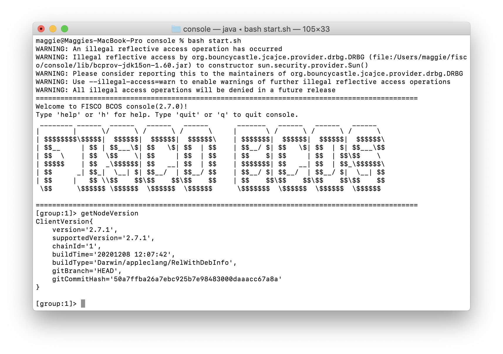

# 搭建第一个区块链网络

标签：``搭建区块链网络`` ``区块链教程`` ``HelloWorld`` ``控制台调用合约``

----

本章介绍FISCO BCOS所需的必要安装和配置。本章通过在单机上部署一条4节点的FISCO BCOS联盟链，帮助用户掌握FISCO BCOS部署流程。请[根据这里](manual/hardware_requirements.md)使用支持的**硬件和平台**操作。

```eval_rst
.. note::
    - 搭建全链路国密版本的链，`请参考这里 <manual/guomi_crypto.html>`_ 。
```

## 1. 搭建单群组FISCO BCOS联盟链

本节以搭建单群组FISCO BCOS链为例操作。使用`开发部署工具 build_chain.sh`脚本在本地搭建一条**4 节点**的FISCO BCOS链，以`Ubuntu 16.04 64bit`系统为例操作。


```eval_rst
.. note::
    - 若需在已有区块链上进行升级，请转至 `版本及兼容 <change_log/index.html>`_ 章节。
    - 搭建多群组的链操作类似， `参考这里 <manual/group_use_cases.html>`_ 。
    - 本节使用预编译的静态`fisco-bcos`二进制文件，在CentOS 7和Ubuntu 16.04 64bit上经过测试。
    - `使用docker模式搭建 <manual/build_chain.html#d-optional>`_ ，供有丰富docker经验和容器化部署需求的用户参考。
```

### 第一步. 安装依赖

`开发部署工具 build_chain.sh`脚本依赖于`openssl, curl`，根据您使用的操作系统，使用以下命令安装依赖。


**安装macOS依赖**

```bash
brew install openssl curl
```

**安装ubuntu依赖**

```bash
sudo apt install -y openssl curl
```

**安装centos依赖**

```bash
sudo yum install -y openssl openssl-devel
```

### 第二步. 创建操作目录, 下载安装脚本

```bash
## 创建操作目录
cd ~ && mkdir -p fisco && cd fisco

## 下载脚本
curl -#LO https://github.com/FISCO-BCOS/FISCO-BCOS/releases/download/v2.7.1/build_chain.sh && chmod u+x build_chain.sh
```

```eval_rst
.. note::
    - 如果因为网络问题导致长时间无法下载build_chain.sh脚本，请尝试 `curl -#LO https://gitee.com/FISCO-BCOS/FISCO-BCOS/raw/master/manual/build_chain.sh && chmod u+x build_chain.sh`
```


### 第三步. 搭建单群组4节点联盟链

在fisco目录下执行下面的指令，生成一条单群组4节点的FISCO链。
请确保机器的`30300~30303，20200~20203，8545~8548`端口没有被占用。

```eval_rst
.. note::
    - 国密版本请执行 ``bash build_chain.sh -l 127.0.0.1:4 -p 30300,20200,8545 -g -G``
    - 其中-g表示生成国密配置，-G表示使用国密SSL连接
    - web3sdk已经支持国密SSL，如果使用web3sdk建议带上-G选项使用国密SSL
```

```bash
bash build_chain.sh -l 127.0.0.1:4 -p 30300,20200,8545
```

```eval_rst
.. note::
    - 其中-p选项指定起始端口，分别是p2p_port,channel_port,jsonrpc_port
    - 出于安全性和易用性考虑，v2.3.0版本最新配置将listen_ip拆分成jsonrpc_listen_ip和channel_listen_ip，但仍保留对listen_ip的解析功能，详细请参考 `这里 <manual/configuration.html#rpc>`_
    - 为便于开发和体验，channel_listen_ip参考配置是 `0.0.0.0` ，出于安全考虑，请根据实际业务网络情况，修改为安全的监听地址，如：内网IP或特定的外网IP
```

命令执行成功会输出`All completed`。如果执行出错，请检查`nodes/build.log`文件中的错误信息。

```bash
Checking fisco-bcos binary...
Binary check passed.
==============================================================
Generating CA key...
==============================================================
Generating keys ...
Processing IP:127.0.0.1 Total:4 Agency:agency Groups:1
==============================================================
Generating configurations...
Processing IP:127.0.0.1 Total:4 Agency:agency Groups:1
==============================================================
[INFO] Execute the download_console.sh script in directory named by IP to get FISCO-BCOS console.
e.g.  bash /home/ubuntu/fisco/nodes/127.0.0.1/download_console.sh
==============================================================
[INFO] FISCO-BCOS Path   : bin/fisco-bcos
[INFO] Start Port        : 30300 20200 8545
[INFO] Server IP         : 127.0.0.1:4
[INFO] Output Dir        : /home/ubuntu/fisco/nodes
[INFO] CA Key Path       : /home/ubuntu/fisco/nodes/cert/ca.key
==============================================================
[INFO] All completed. Files in /home/ubuntu/fisco/nodes
```


### 第四步. 启动FISCO BCOS链

- 启动所有节点

```bash
bash nodes/127.0.0.1/start_all.sh
```

启动成功会输出类似下面内容的响应。否则请使用`netstat -an | grep tcp`检查机器的`30300~30303，20200~20203，8545~8548`端口是否被占用。

```bash
try to start node0
try to start node1
try to start node2
try to start node3
 node1 start successfully
 node2 start successfully
 node0 start successfully
 node3 start successfully
```


### 第五步. 检查进程

- 检查进程是否启动

```bash
ps -ef | grep -v grep | grep fisco-bcos
```

正常情况会有类似下面的输出；
如果进程数不为4，则进程没有启动（一般是端口被占用导致的）

```bash
fisco       5453     1  1 17:11 pts/0    00:00:02 /home/ubuntu/fisco/nodes/127.0.0.1/node0/../fisco-bcos -c config.ini
fisco       5459     1  1 17:11 pts/0    00:00:02 /home/ubuntu/fisco/nodes/127.0.0.1/node1/../fisco-bcos -c config.ini
fisco       5464     1  1 17:11 pts/0    00:00:02 /home/ubuntu/fisco/nodes/127.0.0.1/node2/../fisco-bcos -c config.ini
fisco       5476     1  1 17:11 pts/0    00:00:02 /home/ubuntu/fisco/nodes/127.0.0.1/node3/../fisco-bcos -c config.ini
```


### 第六步. 检查日志输出

- 如下，查看节点node0链接的节点数

```bash
tail -f nodes/127.0.0.1/node0/log/log*  | grep connected
```

正常情况会不停地输出连接信息，从输出可以看出node0与另外3个节点有连接。
```bash
info|2019-01-21 17:30:58.316769| [P2P][Service] heartBeat,connected count=3
info|2019-01-21 17:31:08.316922| [P2P][Service] heartBeat,connected count=3
info|2019-01-21 17:31:18.317105| [P2P][Service] heartBeat,connected count=3
```

- 执行下面指令，检查是否在共识


```bash
tail -f nodes/127.0.0.1/node0/log/log*  | grep +++
```

正常情况会不停输出`++++Generating seal`，表示共识正常。
```bash
info|2020-12-22 17:24:43.729402|[g:1][CONSENSUS][SEALER]++++++++++++++++ Generating seal on,blkNum=1,tx=0,nodeIdx=1,hash=2e133146...
info|2020-12-22 17:24:47.740603|[g:1][CONSENSUS][SEALER]++++++++++++++++ Generating seal on,blkNum=1,tx=0,nodeIdx=1,hash=eb199760...
```


## 2. 配置及使用控制台

```eval_rst
.. important::
    - ``控制台1.x`` 系列基于 `Web3SDK <sdk/java_sdk.html>`_ 实现，``控制台2.6之后`` 基于 `Java SDK <sdk/java_sdk/index.html>`_ 实现，最新版本控制台基于 ``Java SDK`` 实现
    - 2.6及其以上版本控制台使用文档请 `参考这里 <console/console_of_java_sdk.html>`_ ，1.x版本控制台使用文档请 `参考这里 <console/console.html>`_ 
    - 可通过命令 ``./start.sh --version`` 查看当前控制台版本
    - 基于 `Web3SDK <sdk/java_sdk.html>`_ 开发应用时将 ``solidity`` 代码转换为 ``java`` 代码时，必须使用 ``1.x`` 版本控制台，具体请参考  `这里 <console/download_console.html>`_ 
```

在控制台链接FISCO BCOS节点，实现**查询区块链状态、部署调用合约**等功能，能够快速获取到所需要的信息。2.6版本控制台指令详细介绍[参考这里](console/console_of_java_sdk.md)，1.x版本控制台指令详细介绍[参考这里](console/console.md)。

### 第一步. 准备依赖

- 安装java （推荐使用java 14）.

```bash
# ubuntu系统安装java
sudo apt install -y default-jdk

#centos系统安装java
sudo yum install -y java java-devel
```

- 获取控制台并回到fisco目录

```bash
cd ~/fisco && curl -#LO https://github.com/FISCO-BCOS/console/releases/download/v2.7.0/download_console.sh && bash download_console.sh
```

```eval_rst
.. note::
    - 如果因为网络问题导致长时间无法下载，请尝试 `cd ~/fisco && curl -#LO https://gitee.com/FISCO-BCOS/console/raw/master/tools/download_console.sh`
```

- 拷贝控制台配置文件

若节点未采用默认端口，请将文件中的20200替换成节点对应的channel端口。

```bash
# 最新版本控制台使用如下命令拷贝配置文件
cp -n console/conf/config-example.toml console/conf/config.toml
```

- 配置控制台证书

```eval_rst
.. note::
    使用1.x版本控制台时：
     - 搭建国密版时，如果使用国密SSL请执行 ``cp nodes/127.0.0.1/sdk/gm/* console/conf/``
     - 搭建国密版时，请修改 applicationContext.xml 中 encryptType 修改为1
```

```bash
cp -r nodes/127.0.0.1/sdk/* console/conf/
```


### 第二步. 启动并使用控制台

- 启动
```bash
cd ~/fisco/console && bash start.sh
```

输出下述信息表明启动成功 否则请检查conf/config.toml中节点端口配置是否正确

```bash
=============================================================================================
Welcome to FISCO BCOS console(2.6.0)！
Type 'help' or 'h' for help. Type 'quit' or 'q' to quit console.
 ________  ______   ______    ______    ______         _______    ______    ______    ______
|        \|      \ /      \  /      \  /      \       |       \  /      \  /      \  /      \
| $$$$$$$$ \$$$$$$|  $$$$$$\|  $$$$$$\|  $$$$$$\      | $$$$$$$\|  $$$$$$\|  $$$$$$\|  $$$$$$\
| $$__      | $$  | $$___\$$| $$   \$$| $$  | $$      | $$__/ $$| $$   \$$| $$  | $$| $$___\$$
| $$  \     | $$   \$$    \ | $$      | $$  | $$      | $$    $$| $$      | $$  | $$ \$$    \
| $$$$$     | $$   _\$$$$$$\| $$   __ | $$  | $$      | $$$$$$$\| $$   __ | $$  | $$ _\$$$$$$\
| $$       _| $$_ |  \__| $$| $$__/  \| $$__/ $$      | $$__/ $$| $$__/  \| $$__/ $$|  \__| $$
| $$      |   $$ \ \$$    $$ \$$    $$ \$$    $$      | $$    $$ \$$    $$ \$$    $$ \$$    $$
 \$$       \$$$$$$  \$$$$$$   \$$$$$$   \$$$$$$        \$$$$$$$   \$$$$$$   \$$$$$$   \$$$$$$

=============================================================================================
```

若1.x控制台启动失败，参考 [Web3SDK启动失败场景](faq/connect.html)

* 用控制台获取信息

```bash
# 获取客户端版本
[group:1]> getNodeVersion
ClientVersion{
    version='2.6.0',
    supportedVersion='2.6.0',
    chainId='1',
    buildTime='20200819 15:47:59',
    buildType='Darwin/appleclang/RelWithDebInfo',
    gitBranch='HEAD',
    gitCommitHash='e4a5ef2ef64d1943fccc4ebc61467a91779fb1c0'
}
# 获取节点信息
[group:1]> getPeers
[
    PeerInfo{
        nodeID='c1bd77e188cd0783256ee06838020f24a697f9af785438403d3620967a4a3612e3abc4bbe986d1e9dddf62d4236bff0b7d19a935a3cd44889f681409d5bf8692',
        ipAndPort='127.0.0.1:30302',
        agency='agency',
        topic=[
            
        ],
        node='node2'
    },
    PeerInfo{
        nodeID='7f27f5d67f104eacf689790f09313e4343e7887a1a7b79c31cd151be33c7c8dd57c895a66086c3c8e0b54d2fa493407e0d9646b2bd9fc29a94fd3663a5332e6a',
        ipAndPort='127.0.0.1:57266',
        agency='agency',
        topic=[
            _block_notify_1
        ],
        node='node1'
    },
    PeerInfo{
        nodeID='862f26d9681ed4c12681bf81a50d0b8c66dd5b6ee7b0b42a4af12bb37b1ad2442f7dcfe8dac4e737ce9fa46aa94d904e8c474659eabf575d6715995553245be5',
        ipAndPort='127.0.0.1:30303',
        agency='agency',
        topic=[
            
        ],
        node='node3'
    }
]

[group:1]> 
```




## 3. 部署及调用HelloWorld合约

### 第一步. 编写HelloWorld合约

HelloWorld合约提供两个接口，分别是`get()`和`set()`，用于获取/设置合约变量`name`。合约内容如下:

```solidity
pragma solidity ^0.4.24;

contract HelloWorld {
    string name;

    function HelloWorld() {
        name = "Hello, World!";
    }

    function get()constant returns(string) {
        return name;
    }

    function set(string n) {
        name = n;
    }
}
```

### 第二步. 部署HelloWorld合约

为了方便用户快速体验，HelloWorld合约已经内置于控制台中，位于控制台目录下`contracts/solidity/HelloWorld.sol`，参考下面命令部署即可。

```bash
# 在控制台输入以下指令 部署成功则返回合约地址
[group:1]> deploy HelloWorld
transaction hash: 0xd0305411e36d2ca9c1a4df93e761c820f0a464367b8feb9e3fa40b0f68eb23fa
contract address:0xb3c223fc0bf6646959f254ac4e4a7e355b50a344
```

### 第三步. 调用HelloWorld合约

```bash
# 查看当前块高
[group:1]> getBlockNumber
1

# 调用get接口获取name变量 此处的合约地址是deploy指令返回的地址
[group:1]> call HelloWorld 0xb3c223fc0bf6646959f254ac4e4a7e355b50a344 get
---------------------------------------------------------------------------------------------
Return code: 0
description: transaction executed successfully
Return message: Success
---------------------------------------------------------------------------------------------
Return values:
[
    "Hello,World!"
]
---------------------------------------------------------------------------------------------

# 查看当前块高，块高不变，因为get接口不更改账本状态
[group:1]> getBlockNumber
1

# 调用set设置name
[group:1]> call HelloWorld 0xb3c223fc0bf6646959f254ac4e4a7e355b50a344 set "Hello, FISCO BCOS"
transaction hash: 0x7e742c44091e0d6e4e1df666d957d123116622ab90b718699ce50f54ed791f6e
---------------------------------------------------------------------------------------------
transaction status: 0x0
description: transaction executed successfully
---------------------------------------------------------------------------------------------
Output
Receipt message: Success
Return message: Success
---------------------------------------------------------------------------------------------
Event logs
Event: {}

# 再次查看当前块高，块高增加表示已出块，账本状态已更改
[group:1]> getBlockNumber
2

# 调用get接口获取name变量，检查设置是否生效
[group:1]> call HelloWorld 0xb3c223fc0bf6646959f254ac4e4a7e355b50a344 get
---------------------------------------------------------------------------------------------
Return code: 0
description: transaction executed successfully
Return message: Success
---------------------------------------------------------------------------------------------
Return values:
[
    "Hello,FISCO BCOS"
]
---------------------------------------------------------------------------------------------

# 退出控制台
[group:1]> quit
```


