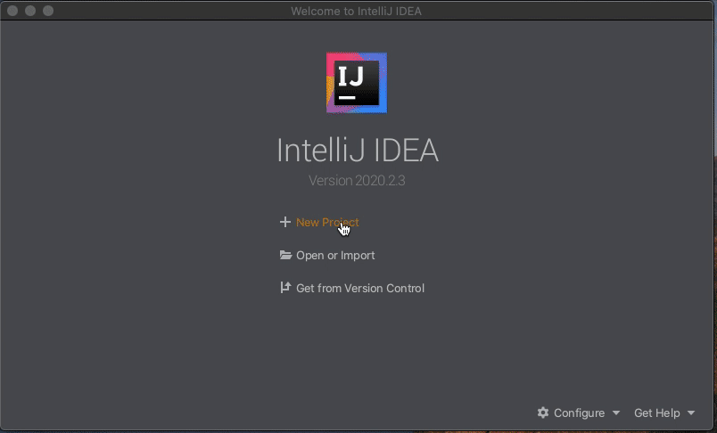

# 快速入门

## 1. 安装环境

- Java：JDK 14 （JDK1.8 至JDK 14都支持）

  

- IDE：IntelliJ IDE. 

  进入[IntelliJ IDE官网](https://www.jetbrains.com/idea/download/)，下载并安装社区版IntelliJ IDE

  

## 2. 搭建一条FISCO BCOS链

请参考[FISCO BCOS安装](../../installation.html#fisco-bcos)搭建。


## 3. Gradle应用

#### 第一步：创建一个Gradle应用

在IntelliJ IDE中创建一个gradle项目。勾选Gradle和Java



#### 第二步：引入Java SDK

在build.gradle中引入Java SDK

```
compile ('org.fisco-bcos.java-sdk:java-sdk:2.6.1')
```

如果您使用maven 通过以下方法引入Java SDK

``` xml
<dependency>
    <groupId>org.fisco-bcos.java-sdk</groupId>
    <artifactId>java-sdk</artifactId>
    <version>2.6.1</version>
</dependency>
```


## 3 SDK证书配置

参考[java sdk证书配置](./configuration.html#id5)。

```eval_rst
.. note::
    - 大部分场景仅需要配置 `certPath` 配置项即可，其他配置项不需额外配置；
    - SDK证书获取：若参考 `安装 <../../installation.html>`_ 搭建区块链，则参考 `这里 <../../installation.html#id7>`_ 将 `nodes/${ip}/sdk/` 目录下的证书拷贝到 `certPath` 指定的路径；若区块链节点参考 `运维部署工具 <../../installation.html>`_ 搭建，则参考 `这里 <../../enterprise_tools/tutorial_one_click.html#id15>`_ 将 `generator/meta` 文件夹下的SDK证书拷贝到 `certPath` 指定路径，`certPath`默认为`conf`目录；
    - SDK与节点间SSL连接方式，可通过节点配置项 `sm_crypto_channel` 判断，该配置项详细说明请参考 `FISCO BCOS配置文件与配置项说明 <../../manual/configuration.html#id10>`_ .
```

将SDK证书拷贝到java sdk的示例如下(这里假设SDK证书位于`~/fisco/nodes/127.0.0.1/sdk`目录)：

```bash
# 假设SDK证书位于~/fisco/nodes/127.0.0.1/sdk/目录
mkdir -p conf && cp -r ~/fisco/nodes/127.0.0.1/sdk/* conf
```

## 4 `solidity`代码转`java`代码

控制台`console`和java sdk均提供了将`solidity`代码转换为`java`代码的工具。

### 4.1 使用控制台提供的工具

控制台`v2.6+`提供了`sol2java.sh`脚本可将`solidity`转换为`java`代码, `sol2java.sh`使用方法如下：

```shell
$ bash sol2java.sh -h
# Compile Solidity Tool
./sol2java.sh [packageName] [solidityFilePath] [javaCodeOutputDir]
 	 packageName:
 		 the package name of the generated Java class file
 	 solidityFilePath:
 		 (optional) the solidity file path or the directory where solidity files located, default: contracts/solidity
 	 javaCodeOutputDir:
 		 (optional) the directory where the generated Java files located, default: contracts/sdk/java
```

**参数如下：**

- `packageName`: 生成`Java`文件的包名
- `solidityFilePath`: (可选)`solidity`文件的路径，支持文件路径和目录路径两种方式，参数为目录时将目录下所有的`solidity`文件进行编译转换。默认目录为`contracts/solidity`。
- `javaCodeOutputDir`: (可选)生成`Java`文件的目录，默认生成在`contracts/sdk/java`目录。 

将`~/fisco/console/contracts/solidity`路径下的`sol`文件转为`java`代码的示例如下：
```bash
$ mkdir -p ~/fisco && cd ~/fisco
# 获取控制台
$ curl -#LO https://github.com/FISCO-BCOS/console/releases/download/v2.6.1/download_console.sh && bash download_console.sh
$ cd ~/fisco/console
# 将sol转为java代码，指定java包名为org.com.fisco
$ bash sol2java.sh org.com.fisco
```
使用java-sdk或控制台将`solidity`代码转换为`java`代码后，即可将生成的`java`代码拷贝到规划的包路径，通过调用该`java`代码部署和调用合约。

### 4.2 使用java-sdk提供的工具
```bash
$ mkdir -p ~/fisco && cd ~/fisco
# 获取java-sdk代码
$ git clone https://github.com/FISCO-BCOS/java-sdk
# 编译
$ ./gradlew clean build -x test
# 进入sdk-demo/dist目录，创建合约存放目录
$ cd sdk-demo/dist && mkdir -p contracts/solidity
# 将需要转换为java代码的sol文件拷贝到~/fisco/java-sdk/dist/contracts/solidity路径下
# 转换sol, 其中${packageName}是生成的java代码包路径
# 生成的java代码位于 ~/fisco/java-sdk/dist.contracts/sdk/java目录下
java -cp "apps/*:lib/*:conf/" org.fisco.bcos.sdk.demo.codegen.DemoSolcToJava ${packageName}
```

## 5 SDK使用示例

```eval_rst
.. note::
    java sdk同时支持将 `solidity` 转换为 `java` 文件后，调用相应的 `java` 方法部署和调用合约，也支持构造交易的方式部署和调用合约，这里主要展示前者的调用方法，后者详细的使用方法请参考 `这里 <./assemble_transaction.html>`_ 
```

### 5.1 `BcosSDK`初始化

`BcosSDK`是使用java sdk开发应用时必须初始化的对象，目前同时支持通过`toml`和`xml`配置文件初始化`BcosSDK`对象。

#### 5.1.1 通过`toml`配置文件初始化`BcosSDK`

java sdk `toml`配置文件说明请参考[这里](./configuration.md)，配置示例请参考java sdk源码的`src/test/resources/config-example.toml`或配置文件说明的第三节配置示例, 通过`toml`配置文件初始化`BcosSDK`的代码示例如下：

```java
public class BcosSDKTest
{
    public BcosSDK initBcosSDK()
    {
        String configFile = BcosSDKTest.class.getClassLoader().getResource("config-example.toml").getPath();
        return BcosSDK.build(configFile);
    }
}
```

#### 5.1.2 通过`xml`配置文件初始化`BcosSDK`

为了适配更多场景，java sdk支持使用`xml`初始化`BcosSDK`, `xml`配置示例请参考java sdk源码的`src/test/resources/applicationContext-sample.xml`, 配置项的含义参考[配置说明](./configuration.md).

通过`xml`配置文件初始化`BcosSDK`之前，需要先引入`spring`。

**通过gradle引入`spring`如下**：

```bash
def spring_version = "4.3.27.RELEASE"
List spring = [
        "org.springframework:spring-core:$spring_version",
        "org.springframework:spring-beans:$spring_version",
        "org.springframework:spring-context:$spring_version",
        "org.springframework:spring-tx:$spring_version",
]
compile spring
```

**通过maven引入`spring`如下**：

```xml
<dependency>
    <groupId>org.springframework</groupId>
    <artifactId>spring-core</artifactId>
    <version>4.3.27.RELEASE</version>

    <groupId>org.springframework</groupId>
    <artifactId>spring-beans</artifactId>
    <version>4.3.27.RELEASE</version>

    <groupId>org.springframework</groupId>
    <artifactId>spring-context</artifactId>
    <version>4.3.27.RELEASE</version>

    <groupId>org.springframework</groupId>
    <artifactId>spring-tx</artifactId>
    <version>4.3.27.RELEASE</version>
</dependency>
```

**使用`applicationContext-sample`初始化`BcosSDK`如下**：

```java
ApplicationContext context =
    new ClassPathXmlApplicationContext("classpath:applicationContext-sample.xml");
BcosSDK sdk = context.getBean(BcosSDK.class);
```

### 5.2 部署和调用合约

以使用java sdk调用群组1的`getBlockNumber`接口获取群组1最新块高，并向群组1部署和调用`HelloWorld`合约为例，对应的示例代码如下：

```java
public class BcosSDKTest
{
    // 获取配置文件路径
    public final String configFile = BcosSDKTest.class.getClassLoader().getResource("config-example.toml").getPath();
     public void testClient() throws ConfigException {
         // 初始化BcosSDK
        BcosSDK sdk =  BcosSDK.build(configFile);
        // 为群组1初始化client
        Client client = sdk.getClient(Integer.valueOf(1));
    
        // 获取群组1的块高
        BlockNumber blockNumber = client.getBlockNumber();

        // 向群组1部署HelloWorld合约
        CryptoKeyPair cryptoKeyPair = client.getCryptoSuite().getCryptoKeyPair();
        HelloWorld helloWorld = HelloWorld.deploy(client, cryptoKeyPair);

        // 调用HelloWorld合约的get接口
        String getValue = helloWorld.get();
        
        // 调用HelloWorld合约的set接口
        TransactionReceipt receipt = helloWorld.set("Hello, fisco");
     }
}
```