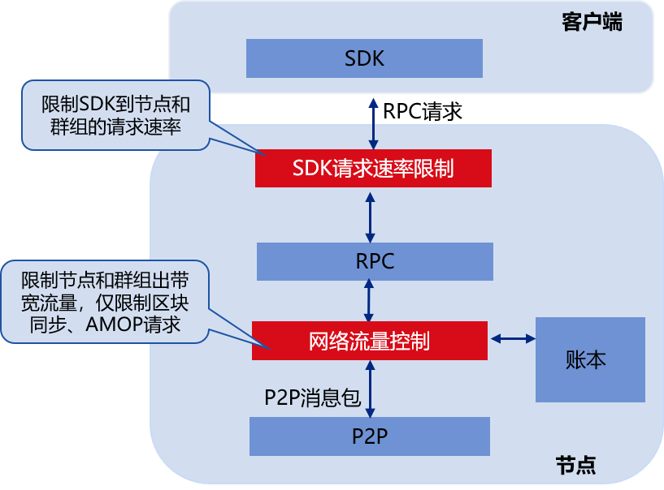

# Flow Control

In order to realize the flexible service of the blockchain system and prevent multiple groups from running in the same process under the multi-group architecture, some groups occupy too many resources to interfere with other groups. FISCO BCOS v2.5.0 introduces flow control.

## architecture

The following figure is a block diagram of flow control, which mainly includes SDK request rate limit and network flow limit. The former limits the request rate of SDK to nodes, and the latter limits the bandwidth flow of nodes and prevents blocks by limiting block sync and AMOP request traffic. Too many block sync and AMOP request message packets affect the performance of the consensus module.




## SDK request rate limit

SDK request rate limit includes node-level request rate limit and group-level request rate limit:

- **Node-level request rate limit**: Limit the total request rate from the SDK client to the node. When the request rate from the SDK to the node exceeds the specified threshold, the node will reject the SDK request and achieve the QoS goal while preventing excessive SDK requests from causing node abnormalities.

- **Group level request rate limit**: Limit the request rate from the SDK client to the group. When the request rate from the SDK to the specified group exceeds the threshold, the group will reject the SDK request.


```eval_rst
.. note::
   When request rate limiting is enabled for both nodes and groups:
    - After receiving the request packet sent by the SDK, the blockchain node first calls the node-level request rate limiting module to determine whether the request should be received;
    - The received request continues to enter the group-level request rate limiting module, and the request that passes the group-level request rate limiting module check will eventually be forwarded to the corresponding group and processed.
```

## Node network flow control

Similar to the SDK request rate limit, the network flow limit also includes node-level flow control and group-level flow control:

- **Node-level flow control**: Limit the average bandwidth of the node. When the average bandwidth of the node exceeds the threshold, the node will suspend the sending of the block after receiving the block sync request, and will also reject the received AMOP request to avoid block sync and AMOP message packet sending impact the node consensus;

- **Group level flow control**: Limit the average bandwidth of each group. When the average bandwidth of the group exceeds the threshold, the group will suspend the block sending and AMOP request packet forwarding logic, and give priority to the network traffic to the consensus module.

```eval_rst
.. note::
   When the flow control function is enabled for both nodes and groups:

    - When the node receives the AMOP request from the client, it calls the node-level flow control module to determine whether it can receive the AMOP request;

    - When a group receives a block request from another node corresponding to the group, and before the group replies to the block, (1) call the node-level flow control module to determine whether the average bandwidth of the node exceeds the set threshold; (2) call the group-level flow control module to determine whether the outgoing bandwidth of the group exceeds the set threshold. If and only if the average outgoing bandwidth at the node level and the group level does not exceed the set threshold, the group will reply to the block.
```

## Configuration options

```eval_rst
.. note::
    - The node-level flow control configuration options are located in `` config.ini``, please refer to `here <../../blockchain_dev/configuration.html#configuration.html#optional-configuration-flow-control>`_
    
    - The group-level flow control options are located in `` group. {Group_id} .ini``, for details, please refer to `here <./../blockchain_dev/configuration.html#optional-configuration-group-flow-control>`_
```